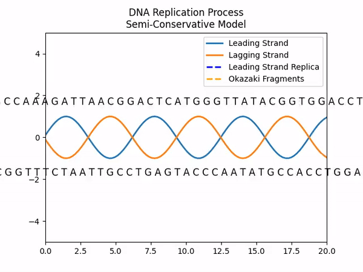
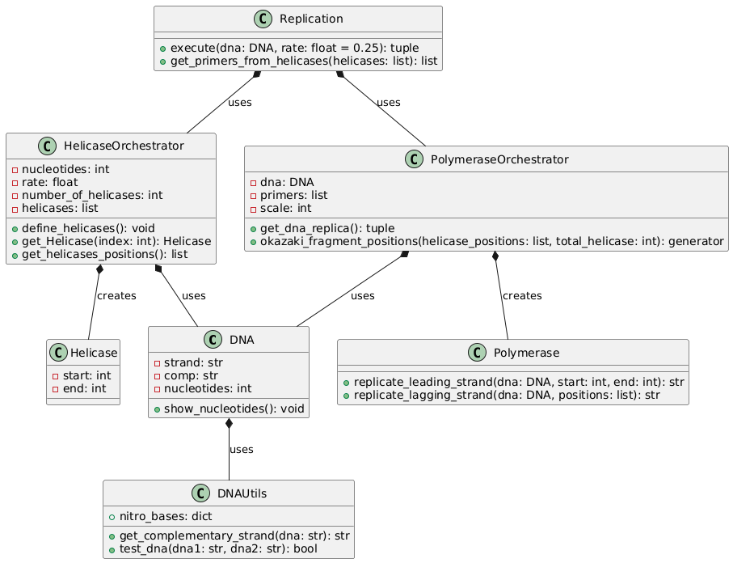

# DNA Replication Process Simulator

This project is a simulation of the DNA replication process prior to mitosis or meiosis, implemented in Python. The program simulates the complete process of DNA replication, including the key stages of the work of enzymes such as helicase and DNA polymerase, the creation of the leading and lagging strand (using Okazaki fragments).

## 1. Description of the Process
The process of DNA replication involves duplicating a DNA molecule so that each daughter cell obtains a complete copy of the genetic material. In this simulation, DNA is modelled as a sequence of nucleotides, and the replication process is carried out, which includes the following steps:
1. **Separation of the DNA strands** by the enzyme **helicase**, which unwinds the DNA double helix.
2. **Creation of the leading and lagging strands** by the enzyme **DNA polymerase**:
   - The leading strand is synthesised continuously.
   - The lagging strand is synthesised into fragments, called **Okazaki fragments**, which are then joined together.
3. **Replication check** to ensure that both resulting strands match the original strands.

The programme provides a complete example of the replication process with specific details on how each step occurs.

## 2. Project Structure
The project is divided into several modules to organise the code in a way that complies with some of the SOLID principles such as Single Responsibility or the Open-Closed principle:
- **dna.py**: Contains the `DNA` class, which models the structure of a DNA molecule, stores the nucleotide sequence and generates its complementary strand.
- **dna_utils.py**: Provides DNA-related utilities, such as complementary strand generation and verification of replication accuracy.
- **helicase.py**: Defines the `Helicase` class, which represents the behaviour of the helicase enzyme during DNA replication, and the `HelicaseOrchestrator` class, which organises the binding process and helicase activity.
- **polymerase.py**: Defines the `Polymerase` class, which contains the methods for replicating the leading and lagging strands, and the `PolymeraseOrchestrator` class, which coordinates the entire replication process for both strands.
- **replication.py**: Controls the execution of the complete replication process using the classes and functions defined in the previous modules.
- **replication.ipynb**: A Jupyter Notebook that runs the complete simulation process, allowing file input and output, and displaying the replication flow.

The following simplified UML diagram explains the functioning of each of the classes described above.

    

## 3. Order of Code Execution
1. The `DNA` class takes a DNA sequence as input and automatically generates its complementary strand. It also contains functions to display the length of the sequence.
2. The `Helicase` class simulates the separation of DNA strands by helicases, which are assigned to different positions in the sequence. The `HelicaseOrchestrator` class organises these helicases and displays their positions on the DNA strand.
3. The `Polymerase` class contains the functions to replicate both the leading strand (continuously) and the lagging strand (using Okazaki fragments). The `PolymeraseOrchestrator` class coordinates the complete replication.
4. The `Replication` class controls the overall flow of the replication process. It uses helicases to separate the strands and then polymerases to replicate the leading and lagging strands.

## 4. Check Results
At the end of the process, the generated daughter strands are checked:
- The first daughter strand is compared to the complementary strand of the original DNA.
- The second daughter strand is compared to the original strand.

If both comparisons are correct, the replication process is successful.

## 5. Credits
This study was carried out by Ricardo Cárdenes Pérez and Susana Suárez Mendoza as part of an internship for the Bioinformatics course taught in the Data Science and Engineering degree at the University of Las Palmas de Gran Canaria.
- [Ricardo Cárdenes](https://github.com/ricardocardn)
- [Susana Suárez](https://github.com/susanasrez)
